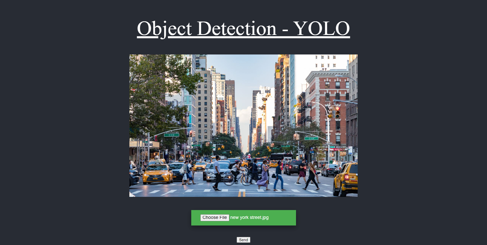
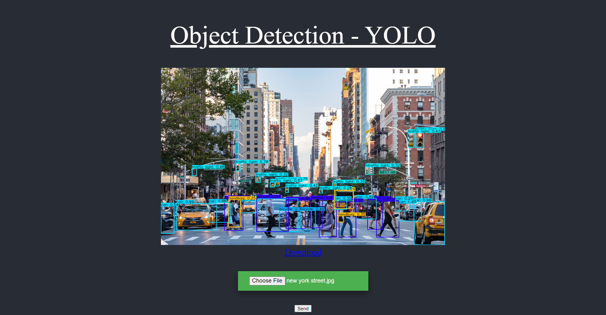

# YOLOv4 Object Detection API Server

This repository is mixture version of https://github.com/theAIGuysCode/Object-Detection-API (YOLOv3 REST API) and
https://github.com/theAIGuysCode/tensorflow-yolov4-tflite (YOLOv4).
so that I added REST API functions on YOLOv4.

YOLOv4, YOLOv4-tiny Implemented in Tensorflow 2.0. Convert YOLO v4, YOLOv3, YOLO tiny .weights to .pb, .tflite and trt format for tensorflow, tensorflow lite, tensorRT, Flask, REST API.

## 1. Install
### Conda (Recommended)

```shell
# Tensorflow CPU
conda env create -f conda-cpu.yml
conda activate yolov4-cpu

# Tensorflow GPU
conda env create -f conda-gpu.yml
conda activate yolov4-gpu

# For apple silicon mac
conda env create -f conda-gpu-apple-silicon-mac.yml
conda activate yolov4-gpu
```

### Pip
```shell
# TensorFlow CPU
pip install -r requirements.txt

# TensorFlow GPU
pip install -r requirements-gpu.txt
```

## Downloading Official Pre-trained Weights
YOLOv4 comes pre-trained and able to detect 80 classes. For easy demo purposes we will use the pre-trained weights.
Download pre-trained yolov4.weights file: https://github.com/AlexeyAB/darknet/releases/download/yolov4/yolov4.weights
or
https://github.com/AlexeyAB/darknet/releases

Copy and paste yolov4.weights from your downloads folder into the 'data' folder of this repository.

If you want to use yolov4-tiny.weights, a smaller model that is faster at running detections but less accurate, download file here: https://github.com/AlexeyAB/darknet/releases/download/darknet_yolo_v4_pre/yolov4-tiny.weights

## Using Custom Trained YOLOv4 Weights
<strong>Learn How To Train Custom YOLOv4 Weights here: https://www.youtube.com/watch?v=mmj3nxGT2YQ </strong>

Copy and paste your custom .weights file into the 'data' folder and copy and paste your custom .names into the 'data/classes/' folder.

The only change within the code you need to make in order for your custom model to work is on line 14 of 'core/config.py' file.
Update the code to point at your custom .names file as seen below. (my custom .names file is called custom.names but yours might be named differently)


<strong>Note:</strong> If you are using the pre-trained yolov4 then make sure that line 14 remains <strong>coco.names</strong>.

## Convert
To implement YOLOv4 using TensorFlow, first we convert the .weights into the corresponding TensorFlow model files and then run the model.
```shell
# Convert darknet weights to tensorflow
## yolov4
python save_model.py --weights ./data/yolov4.weights --output ./checkpoints/yolov4-416 --input_size 416 --model yolov4 

# yolov4-tiny
python save_model.py --weights ./data/yolov4-tiny.weights --output ./checkpoints/yolov4-tiny-416 --input_size 416 --model yolov4 --tiny

# custom yolov4
python save_model.py --weights ./data/custom.weights --output ./checkpoints/custom-416 --input_size 416 --model yolov4 
```

## Run
### Run Flask app
```shell
python app.py
```

### Run Waitress wsgi for production deployment
```shell
python waitress-server.py
```

<br><br>

## 2. Usage

### Image Upload (http://localhost:5050)
The output will be generated and saved into `static/detections/OUTPUT_NAME.png`
#### Request example


#### Response example


<br><br>

### Detections by image files (POST http://localhost:5050/detections/by-image-files)
need more than 0 image files, multipart/form-data, key name is "images"

#### Request example(python.requests)
```python
import requests

url = "http://127.0.0.1:5050/detections/by-image-files"

payload={}
files=[
  ('images',('dog.jpg',open('/C:/Users/Qone/repos/YOLOv4-Object-Detection-API-Server/data/images/dog.jpg','rb'),'image/jpeg')),
  ('images',('kite.jpg',open('/C:/Users/Qone/repos/YOLOv4-Object-Detection-API-Server/data/images/kite.jpg','rb'),'image/jpeg'))
]
headers = {}

response = requests.request("POST", url, headers=headers, data=payload, files=files)

print(response.text)
```


<br><br>

## Reference
for more information
- https://github.com/theAIGuysCode/tensorflow-yolov4-tflite
- https://github.com/theAIGuysCode/Object-Detection-API
- https://www.youtube.com/channel/UCrydcKaojc44XnuXrfhlV8Q
